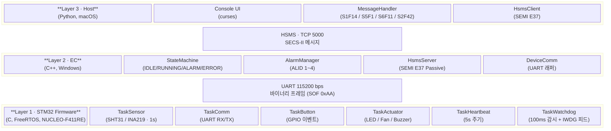
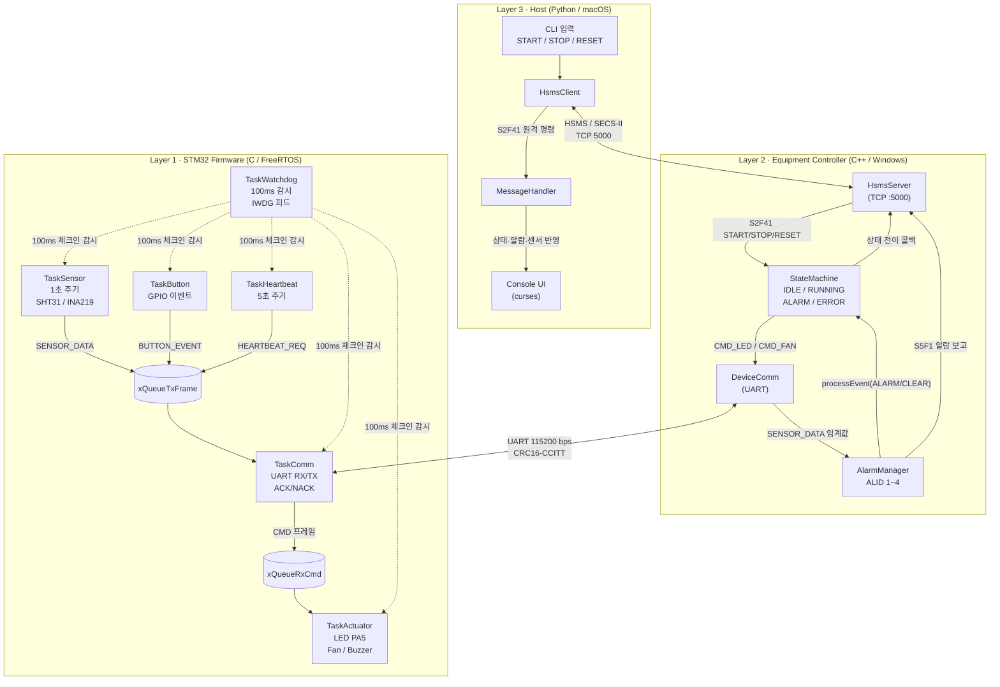
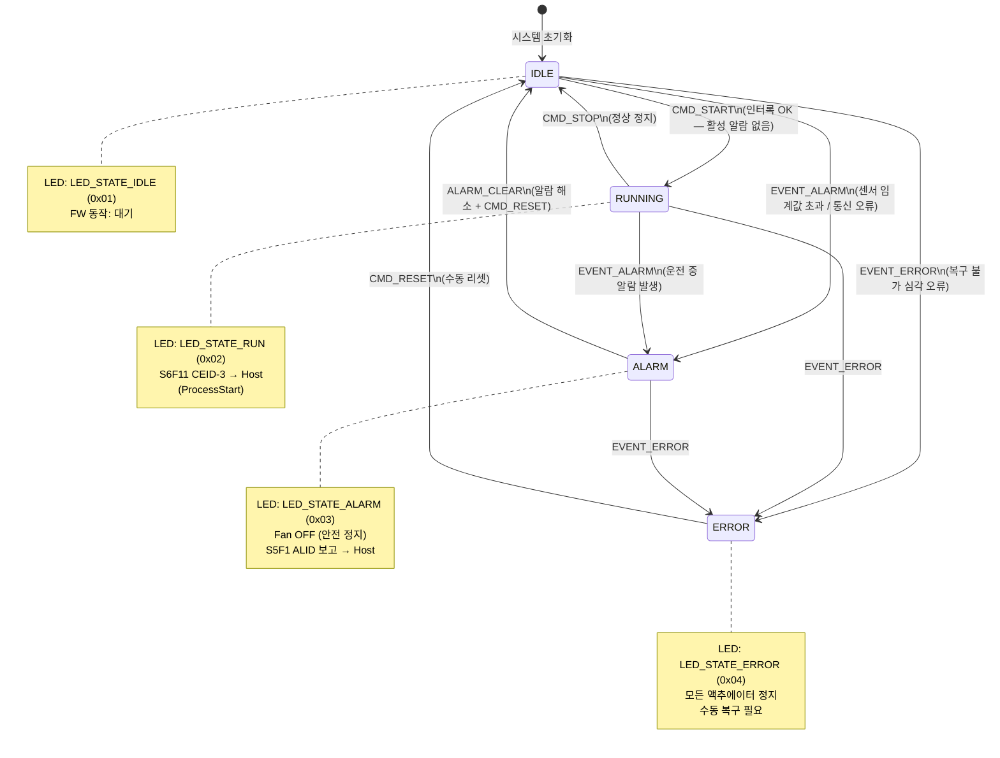
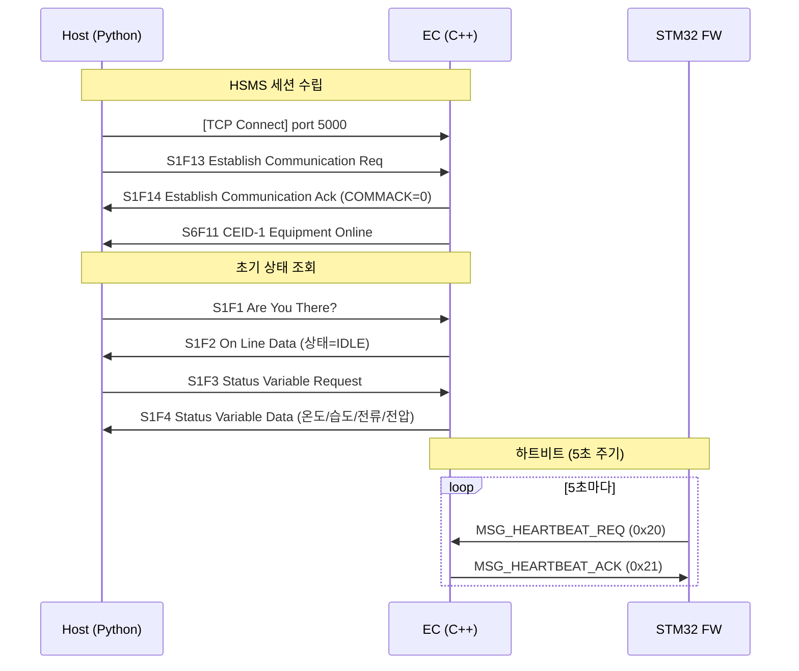
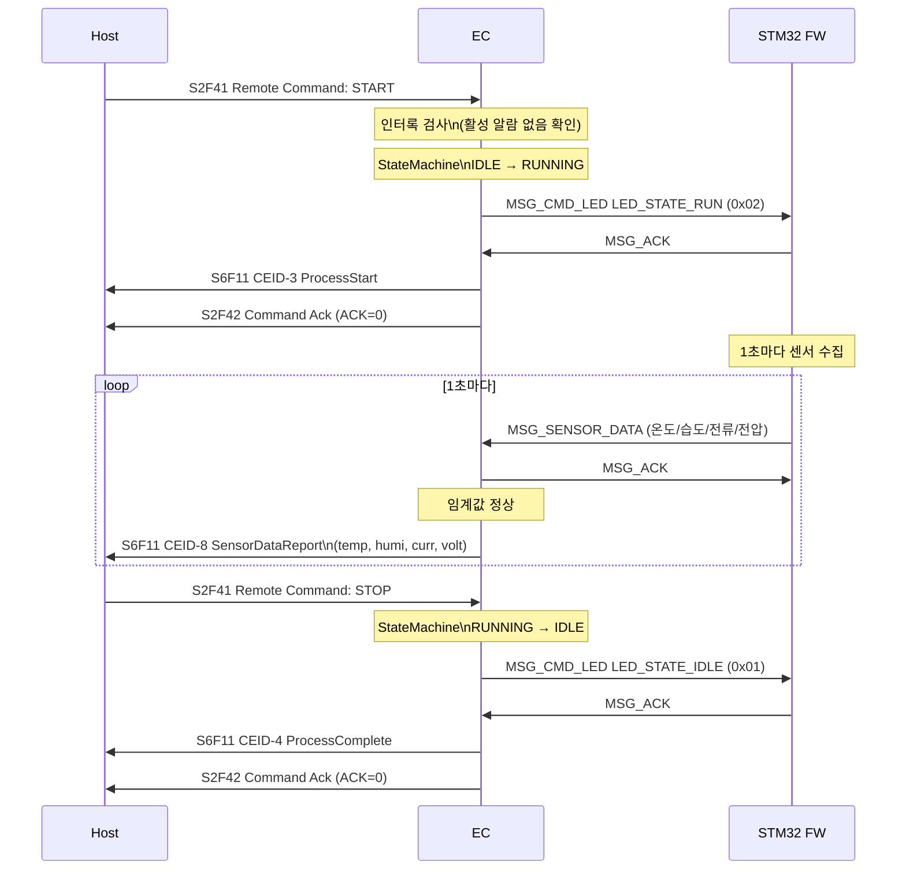
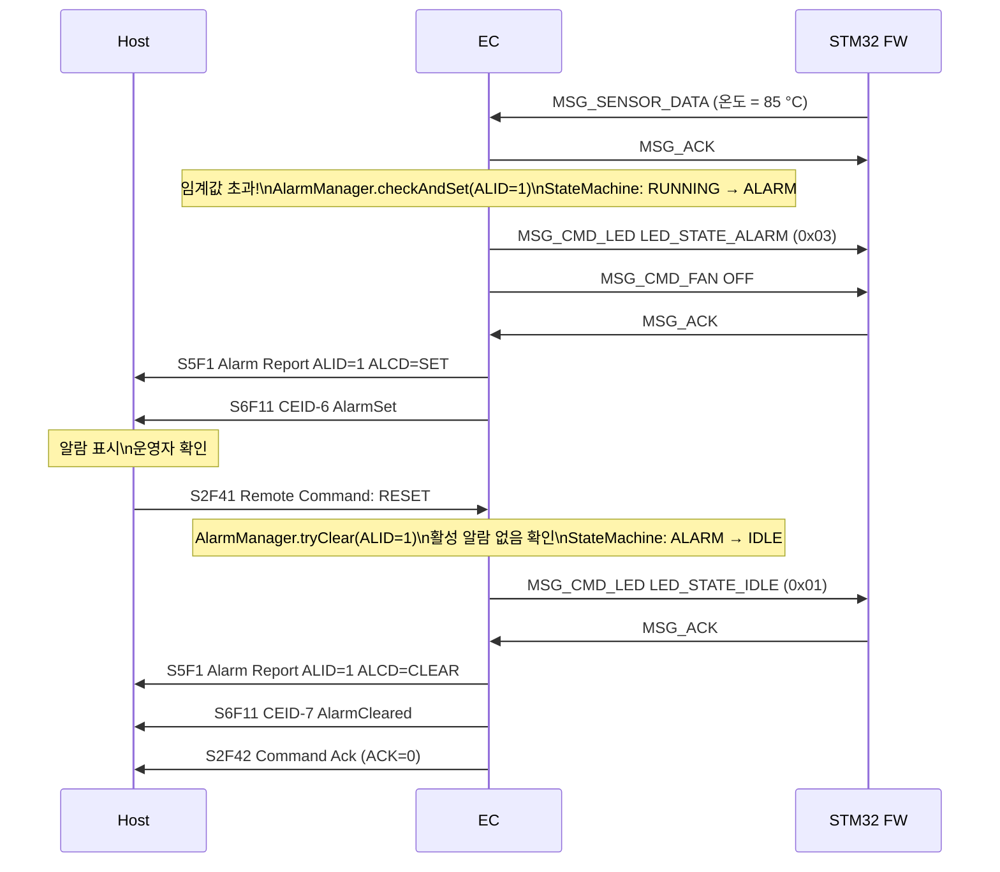
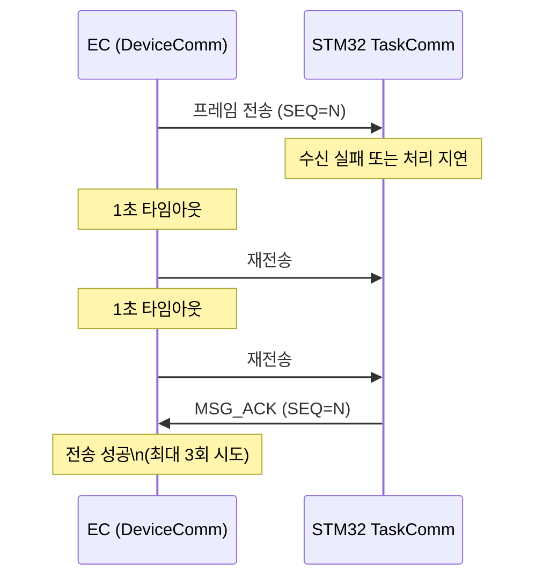
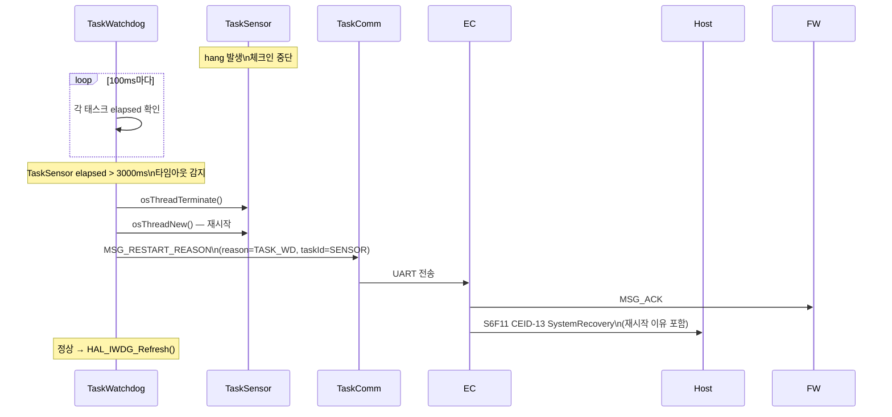
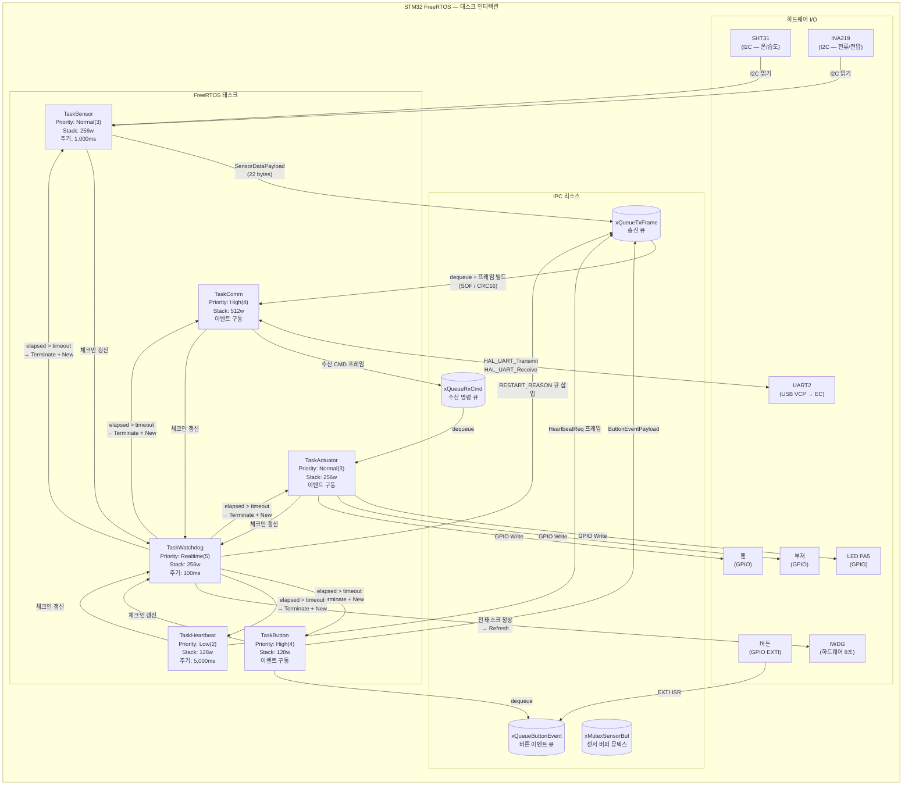
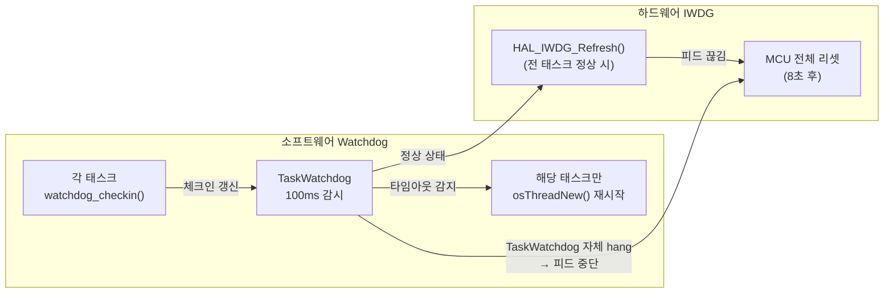

# 장비 제어 시스템 — 다이어그램 문서

> SECS/GEM 기반 3계층 장비 제어 시스템 (STM32 FW / EC / Host)

---

## 1. 전체 구조 블록 다이어그램





**계층 요약**

| 계층 | 플랫폼 | 주요 역할 | 통신 |
|------|--------|----------|------|
| Layer 1 · FW | STM32 NUCLEO-F411RE | 센서 수집, 액추에이터 제어, 실시간 태스크 | UART (115200 bps) |
| Layer 2 · EC | Windows PC (C++) | GEM 상태 머신, 알람/이벤트 관리, HSMS 서버 | TCP 5000 |
| Layer 3 · Host | macOS (Python) | 모니터링 UI, 원격 명령 전송 | HSMS 클라이언트 |

---

## 2. 장비 상태머신 다이어그램



**알람 ID (ALID) 및 발생 조건**

| ALID | 이름 | 발생 조건 | 임계값 |
|------|------|---------|--------|
| 1 | TEMP_HIGH | 온도 초과 | > 80 °C |
| 2 | HUMIDITY_HIGH | 습도 초과 | > 95 % |
| 3 | SENSOR_ERROR | SHT31 / INA219 오류 | flags = 0 |
| 4 | UART_COMM_ERROR | Heartbeat 무응답 | 10초 초과 |

**인터록 규칙**

- `ALARM` 또는 `ERROR` 상태에서는 `CMD_START` 거부 → S2F42 NACK 반환
- `ALARM_CLEAR`는 모든 활성 알람이 해소된 경우에만 전이
- `EVENT_ERROR`는 어느 상태에서든 즉시 `ERROR`로 전이

---

## 3. 메시지 중심 시퀀스 다이어그램

### 3-A. 세션 수립 및 초기화



### 3-B. 정상 운전 — START → 센서 보고 → STOP



### 3-C. 알람 발생 및 복구



### 3-D. UART 프레임 재전송 (ACK 타임아웃)



### 3-E. Task Watchdog 복구



---

## 4. 태스크 인터랙션 다이어그램



**태스크 우선순위 및 Watchdog 타임아웃**

| 태스크 | 우선순위 | 스택 | 실행 주기 | WD 타임아웃 |
|--------|---------|------|---------|-----------|
| TaskWatchdog | Realtime (5) | 256w | 100ms | — (감시자) |
| TaskComm | High (4) | 512w | 이벤트 | 3,000ms |
| TaskButton | High (4) | 128w | 이벤트 | 3,000ms |
| TaskSensor | Normal (3) | 256w | 1,000ms | 3,000ms |
| TaskActuator | Normal (3) | 256w | 이벤트 | 3,000ms |
| TaskHeartbeat | Low (2) | 128w | 5,000ms | 15,000ms |

**이중 Watchdog 구조**



**메시지 큐 흐름 요약**

```
[생산자]                        [xQueueTxFrame]      [소비자]
─────────────────────────────────────────────────────────────────
TaskSensor  → SENSOR_DATA  ──┐
TaskButton  → BUTTON_EVENT ──┼──→  xQueueTxFrame  ──→  TaskComm  ──→  EC (UART)
TaskHB      → HB_REQ       ──┘
TaskWatchdog→ RESTART_REASON─┘

[생산자]                        [xQueueRxCmd]        [소비자]
─────────────────────────────────────────────────────────────────
TaskComm (수신 CMD) ──────────→  xQueueRxCmd   ──→  TaskActuator ──→ GPIO
                                                                   (LED / Fan / Buzzer)
```

---

## 부록 — 프로토콜 프레임 구조

### STM32 ↔ EC 내부 바이너리 프레임

```
┌──────┬──────┬──────┬──────┬──────┬────────────┬──────┬──────┐
│ SOF  │ TYPE │ SEQ  │LEN_L │LEN_H │  PAYLOAD   │CRC_L │CRC_H │
│ 0xAA │  1B  │  1B  │  1B  │  1B  │  0 ~ 64B   │  1B  │  1B  │
└──────┴──────┴──────┴──────┴──────┴────────────┴──────┴──────┘
  CRC 범위: TYPE ~ PAYLOAD 끝  (CRC16-CCITT, poly=0x1021, init=0xFFFF)
```

| TYPE | 방향 | 이름 | Payload |
|------|------|------|---------|
| 0x01 | FW → EC | MSG_SENSOR_DATA | SensorDataPayload (22B) |
| 0x02 | FW → EC | MSG_BUTTON_EVENT | ButtonEventPayload (1B) |
| 0x03 | FW → EC | MSG_RESTART_REASON | RestartReasonPayload (3B) |
| 0x04 | 양방향 | MSG_ACK | AckPayload (1B) |
| 0x05 | 양방향 | MSG_NACK | (1B) |
| 0x10 | EC → FW | MSG_CMD_FAN | CmdFanPayload (1B) |
| 0x11 | EC → FW | MSG_CMD_BUZZER | CmdBuzzerPayload (1B) |
| 0x12 | EC → FW | MSG_CMD_LED | CmdLedPayload (1B) |
| 0x20 | FW → EC | MSG_HEARTBEAT_REQ | (0B) |
| 0x21 | EC → FW | MSG_HEARTBEAT_ACK | (0B) |

### HSMS 메시지 헤더 (10 bytes)

```
┌────────────┬────────┬──────────┬─────────┬────────┬────────────┐
│ SESSION_ID │ STREAM │ FUNCTION │  FLAGS  │ S-TYPE │  SYS_BYTES │
│    (2B)    │ (1B)   │   (1B)   │  (1B)   │  (1B)  │    (4B)    │
└────────────┴────────┴──────────┴─────────┴────────┴────────────┘
  앞에 LENGTH (4B Big-endian) 포함 시 총 14B 헤더
```

| S/F | 방향 | 이름 | 설명 |
|-----|------|------|------|
| S1F1 | H → EC | Are You There | 장비 상태 조회 |
| S1F2 | EC → H | On Line Data | 상태 응답 |
| S1F13 | H → EC | Establish Communication Req | 세션 수립 요청 |
| S1F14 | EC → H | Establish Communication Ack | 세션 수립 응답 |
| S2F41 | H → EC | Remote Command | START / STOP / RESET |
| S2F42 | EC → H | Remote Command Ack | ACK / NACK |
| S5F1 | EC → H | Alarm Report | 알람 발생/해제 (비동기) |
| S6F11 | EC → H | Event Report | CEID 이벤트 (비동기) |

**Collection Event ID (CEID)**

| CEID | 이벤트 | 발생 시점 |
|------|--------|---------|
| 1 | EquipmentOnline | HSMS 세션 수립 |
| 3 | ProcessStart | IDLE → RUNNING |
| 4 | ProcessComplete | RUNNING → IDLE |
| 6 | AlarmSet | 알람 활성화 |
| 7 | AlarmCleared | 알람 해제 |
| 8 | SensorDataReport | 1초 주기 센서 보고 |
| 13 | SystemRecovery | Task Watchdog 재시작 |
